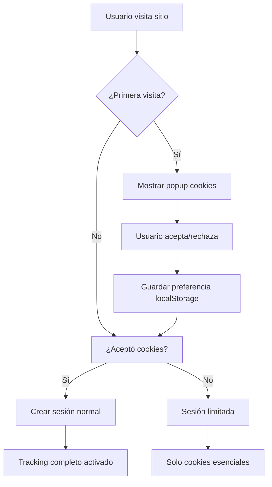

# 🍪 Sistema de Gestión de Cookies y Sesiones
## Sistema de Actas Municipales - Documentación Técnica

### 📋 **Índice**
1. [Resumen Ejecutivo](#resumen-ejecutivo)
2. [Configuración del Sistema](#configuración-del-sistema)
3. [Tipos de Cookies Utilizadas](#tipos-de-cookies-utilizadas)
4. [Gestión de Sesiones](#gestión-de-sesiones)
5. [Sistema de Notificación de Cookies](#sistema-de-notificación-de-cookies)
6. [Herramientas de Debug y Monitoreo](#herramientas-de-debug-y-monitoreo)
7. [Seguridad y Privacidad](#seguridad-y-privacidad)
8. [Verificación y Testing](#verificación-y-testing)
9. [Solución de Problemas](#solución-de-problemas)
10. [Referencias Técnicas](#referencias-técnicas)

---

## 📊 **Resumen Ejecutivo**

El Sistema de Actas Municipales implementa un completo sistema de gestión de cookies y sesiones que cumple con:

- ✅ **Normativas de Privacidad**: Notificación obligatoria a usuarios sobre el uso de cookies
- ✅ **Seguridad Avanzada**: Configuración robusta con protección CSRF y HttpOnly
- ✅ **Transparencia Total**: Herramientas de monitoreo y debug para administradores
- ✅ **Experiencia de Usuario**: Popup informativo no intrusivo con opción de detalles
- ✅ **Cumplimiento Legal**: Consentimiento explícito y almacenamiento de preferencias

### 🎯 **Objetivos Cumplidos**
1. **Notificación Automática**: Popup que aparece solo en la primera visita
2. **Aceptación Persistente**: Una vez aceptado, no vuelve a aparecer
3. **Información Detallada**: Modal con explicación completa de todos los tipos de cookies
4. **Herramientas de Admin**: Widget de debug para supervisión en tiempo real
5. **Integración en Login**: Información sobre cookies en el proceso de autenticación

---

## ⚙️ **Configuración del Sistema**

### **Archivo: `config/settings.py`**

```python
# ==========================================
# CONFIGURACIÓN AVANZADA DE SESIONES
# ==========================================

# Motor de sesiones con PostgreSQL
SESSION_ENGINE = 'django.contrib.sessions.backends.db'
SESSION_COOKIE_NAME = 'actas_sessionid'  # Nombre personalizado
SESSION_COOKIE_AGE = 7200  # 2 horas de duración
SESSION_SAVE_EVERY_REQUEST = True  # Actualizar en cada request
SESSION_EXPIRE_AT_BROWSER_CLOSE = True  # Expirar al cerrar navegador

# Seguridad de cookies
SESSION_COOKIE_SECURE = False  # True en producción con HTTPS
SESSION_COOKIE_HTTPONLY = True  # Protección contra XSS
SESSION_COOKIE_SAMESITE = 'Lax'  # Protección CSRF

# Configuración CSRF
CSRF_COOKIE_NAME = 'actas_csrftoken'
CSRF_COOKIE_HTTPONLY = False  # Necesario para JavaScript
CSRF_COOKIE_SECURE = False  # True en producción
CSRF_COOKIE_SAMESITE = 'Lax'
CSRF_USE_SESSIONS = True
CSRF_TRUSTED_ORIGINS = ['http://localhost:8000', 'http://127.0.0.1:8000']

# Middleware personalizado
MIDDLEWARE = [
    'django.middleware.security.SecurityMiddleware',
    'django.contrib.sessions.middleware.SessionMiddleware',
    'apps.auditoria.session_middleware.AdvancedSessionMiddleware',  # ← CUSTOM
    'django.middleware.common.CommonMiddleware',
    'django.middleware.csrf.CsrfViewMiddleware',
    'django.contrib.auth.middleware.AuthenticationMiddleware',
    'django.contrib.messages.middleware.MessageMiddleware',
    'django.middleware.clickjacking.XFrameOptionsMiddleware',
]
```

### **Middleware Personalizado: `apps/auditoria/session_middleware.py`**

El middleware personalizado añade capacidades avanzadas de tracking:

```python
class AdvancedSessionMiddleware:
    """
    Middleware que extiende la funcionalidad de sesiones con:
    - Tracking de IP y User Agent
    - Historial de navegación
    - Conteo de requests
    - Logging detallado
    """
    
    def __init__(self, get_response):
        self.get_response = get_response

    def __call__(self, request):
        # Inicializar datos de sesión si es nueva
        if not request.session.session_key:
            # Primera visita del usuario
            
        # Tracking de actividad
        self.track_session_activity(request)
        
        response = self.get_response(request)
        return response
```

**Características principales:**
- ✅ Detección automática de nuevas sesiones
- ✅ Tracking de IP y User Agent por seguridad
- ✅ Historial de páginas visitadas (últimas 10)
- ✅ Conteo de requests por sesión
- ✅ Logging detallado para auditoría

---

## 🍪 **Tipos de Cookies Utilizadas**

### **1. Cookies Esenciales (Obligatorias)**

| Cookie | Propósito | Duración | HttpOnly | Secure |
|--------|-----------|----------|----------|---------|
| `actas_sessionid` | Identificador único de sesión | 2 horas | ✅ Sí | 🔧 Prod |
| `actas_csrftoken` | Protección contra ataques CSRF | Sesión | ❌ No* | 🔧 Prod |

*\*El token CSRF debe ser accesible a JavaScript para formularios AJAX*

### **2. Cookies Funcionales**

| Cookie | Propósito | Duración | Persistencia |
|--------|-----------|----------|--------------|
| `cookies_accepted` | Registro de aceptación de cookies | Permanente | localStorage |
| `cookies_accepted_date` | Fecha de aceptación | Permanente | localStorage |
| `cookies_notification_shown` | Control de popup por sesión | Sesión | sessionStorage |

### **3. Cookies de Autenticación OAuth**

Para proveedores externos (GitHub, Google):
- `github_oauth_state`: Estado de OAuth con GitHub
- `google_oauth_state`: Estado de OAuth con Google
- Duración: Temporal durante proceso de autenticación

---

## 🔐 **Gestión de Sesiones**

### **Ciclo de Vida de una Sesión**



### **Datos Almacenados por Sesión**

```json
{
  "session_key": "abc123...",
  "created_at": "2024-01-15T10:30:00Z",
  "last_activity": "2024-01-15T11:45:30Z",
  "ip_address": "192.168.1.100",
  "user_agent": "Mozilla/5.0...",
  "path_history": [
    "/dashboard/",
    "/actas/lista/",
    "/actas/nueva/"
  ],
  "request_count": 15,
  "user_id": 123
}
```

### **Configuración de Expiración**

- **Duración Estándar**: 2 horas de inactividad
- **Renovación Automática**: En cada request si está activa
- **Expiración por Navegador**: Se elimina al cerrar el navegador
- **Limpieza Automática**: Django limpia sesiones expiradas automáticamente

---

## 🎨 **Sistema de Notificación de Cookies**

### **Componente Principal: `cookie_notification.html`**

El sistema incluye:

#### **1. Popup Principal**
- Aparece en la primera visita
- Diseño no intrusivo pero visible
- Botones de aceptación y más información
- Animación suave de entrada

#### **2. Modal Informativo**
- Explicación detallada de cada tipo de cookie
- Información de seguridad y privacidad
- Detalles técnicos para administradores
- Opciones de aceptación y cierre

### **Lógica de Funcionamiento**

```javascript
// Verificación automática al cargar la página
document.addEventListener('DOMContentLoaded', function() {
    if (!localStorage.getItem('cookies_accepted') && 
        !sessionStorage.getItem('cookies_notification_shown')) {
        showCookieNotification();
        sessionStorage.setItem('cookies_notification_shown', 'true');
    }
});

// Función de aceptación
function acceptCookies() {
    localStorage.setItem('cookies_accepted', 'true');
    localStorage.setItem('cookies_accepted_date', new Date().toISOString());
    hideCookieNotification();
    logCookieAcceptance(); // Log al servidor
}
```

### **Estados del Sistema**

| Estado | Condición | Acción |
|--------|-----------|--------|
| **Primera Visita** | No existe `cookies_accepted` | Mostrar popup |
| **Ya Aceptado** | Existe `cookies_accepted` | No mostrar popup |
| **Misma Sesión** | Existe `cookies_notification_shown` | No mostrar en esta sesión |
| **Testing** | Función `showCookieNotificationTest()` | Mostrar manualmente |

---

## 🛠️ **Herramientas de Debug y Monitoreo**

### **Widget de Debug para Administradores**

Solo visible para `user.is_superuser`, incluye:

#### **Panel de Información**
- 📊 Datos de sesión actual
- 🍪 Lista de todas las cookies activas
- 📍 Historial de navegación
- 🔢 Estadísticas de requests

#### **Controles Disponibles**
- 🗑️ Limpiar datos de sesión
- 🔄 Recargar información en tiempo real
- ❌ Cerrar sesión completamente
- 🧪 Test de cookies (mostrar popup manualmente)

### **APIs de Debug**

#### **1. `/auditoria/debug/session-debug-api/`**
```json
{
  "session_key": "abc123...",
  "session_data": {...},
  "cookies": {...},
  "user_info": {...},
  "path_history": [...],
  "statistics": {...}
}
```

#### **2. `/auditoria/debug/clear-session-data/`**
- Limpia datos de debug de la sesión
- Mantiene la autenticación del usuario
- Resetea contadores y historial

#### **3. `/auditoria/debug/log-frontend-activity/`**
- Recibe logs desde el frontend
- Registra aceptación de cookies
- Almacena eventos de usuario

### **Logging del Sistema**

```python
# Configuración en settings.py
LOGGING = {
    'version': 1,
    'disable_existing_loggers': False,
    'handlers': {
        'session_file': {
            'level': 'INFO',
            'class': 'logging.FileHandler',
            'filename': 'logs/sessions.log',
        },
    },
    'loggers': {
        'session_middleware': {
            'handlers': ['session_file'],
            'level': 'INFO',
            'propagate': True,
        },
    },
}
```

**Eventos Registrados:**
- ✅ Creación de nuevas sesiones
- ✅ Actividad de usuarios autenticados
- ✅ Aceptación de cookies
- ✅ Errores de sesión
- ✅ Eventos de seguridad

---

## 🔒 **Seguridad y Privacidad**

### **Medidas de Seguridad Implementadas**

#### **1. Protección Contra XSS**
- `SESSION_COOKIE_HTTPONLY = True`
- Las cookies de sesión no son accesibles vía JavaScript
- Previene robo de cookies mediante scripts maliciosos

#### **2. Protección CSRF**
- Token CSRF único por sesión
- Validación automática en formularios
- Configuración personalizada para AJAX

#### **3. Configuración de SameSite**
- `SESSION_COOKIE_SAMESITE = 'Lax'`
- Previene ataques de request falsificados
- Balance entre seguridad y funcionalidad

#### **4. Control de Expiración**
- Expiración automática por inactividad (2 horas)
- Renovación en cada request activo
- Limpieza automática de sesiones expiradas

### **Cumplimiento de Privacidad**

#### **Transparencia**
- ✅ Notificación clara al usuario
- ✅ Explicación detallada del propósito de cada cookie
- ✅ Opción de ver información completa
- ✅ Control de aceptación explícita

#### **Almacenamiento de Datos**
- Datos de sesión en PostgreSQL local
- No compartición con terceros
- Retención limitada por configuración de expiración
- Acceso restringido solo a administradores

#### **Derechos del Usuario**
- Visualización de cookies activas (administradores)
- Capacidad de cerrar sesión en cualquier momento
- Información transparente sobre el uso de datos
- No tracking innecesario

---

## 🧪 **Verificación y Testing**

### **1. Verificación Manual**

#### **Probar Notificación de Cookies**
```javascript
// En la consola del navegador
showCookieNotificationTest();
```

#### **Verificar Estado de Cookies**
```javascript
// Verificar aceptación
console.log(localStorage.getItem('cookies_accepted'));
console.log(localStorage.getItem('cookies_accepted_date'));

// Limpiar para probar de nuevo
localStorage.removeItem('cookies_accepted');
sessionStorage.removeItem('cookies_notification_shown');
```

#### **Probar Widget de Debug**
1. Iniciar sesión como superusuario
2. El widget aparece automáticamente (🔧)
3. Verificar información de sesión
4. Probar controles de limpieza

### **2. Testing Automatizado**

#### **Tests de Django**
```python
# tests/test_sessions.py
class SessionTestCase(TestCase):
    def test_session_creation(self):
        response = self.client.get('/')
        self.assertIn('actas_sessionid', response.cookies)
    
    def test_csrf_protection(self):
        response = self.client.get('/')
        self.assertIn('actas_csrftoken', response.cookies)
    
    def test_middleware_tracking(self):
        session = self.client.session
        self.assertIn('path_history', session)
```

#### **Tests JavaScript**
```javascript
// tests/cookie-notification.test.js
describe('Cookie Notification', () => {
    test('shows notification on first visit', () => {
        localStorage.clear();
        sessionStorage.clear();
        // Simular primera visita
        expect(shouldShowNotification()).toBe(true);
    });
    
    test('hides after acceptance', () => {
        acceptCookies();
        expect(localStorage.getItem('cookies_accepted')).toBe('true');
    });
});
```

### **3. Comandos de Verificación**

#### **Verificar Configuración**
```bash
# Verificar settings de sesión
python manage.py shell
>>> from django.conf import settings
>>> print(settings.SESSION_COOKIE_NAME)
>>> print(settings.SESSION_COOKIE_AGE)
```

#### **Verificar Base de Datos**
```sql
-- Ver sesiones activas
SELECT session_key, expire_date, session_data 
FROM django_session 
WHERE expire_date > NOW();

-- Contar sesiones por fecha
SELECT DATE(expire_date), COUNT(*) 
FROM django_session 
GROUP BY DATE(expire_date);
```

#### **Verificar Logs**
```bash
# Ver logs de sesiones (si están configurados)
tail -f logs/sessions.log

# Buscar eventos específicos
grep "SESSION_CREATED" logs/sessions.log
grep "COOKIE_ACCEPTED" logs/sessions.log
```

---

## 🔧 **Solución de Problemas**

### **Problemas Comunes y Soluciones**

#### **1. El popup de cookies no aparece**

**Diagnóstico:**
```javascript
// En consola del navegador
console.log('Cookies accepted:', localStorage.getItem('cookies_accepted'));
console.log('Notification shown:', sessionStorage.getItem('cookies_notification_shown'));
```

**Soluciones:**
- Limpiar localStorage: `localStorage.clear()`
- Limpiar sessionStorage: `sessionStorage.clear()`
- Probar manualmente: `showCookieNotificationTest()`

#### **2. El widget de debug no aparece**

**Verificaciones:**
- Usuario debe ser superusuario: `user.is_superuser = True`
- Template debe incluir el widget
- JavaScript debe estar cargado correctamente

**Solución:**
```python
# En Django admin
user = User.objects.get(username='tu_usuario')
user.is_superuser = True
user.save()
```

#### **3. Sesiones se pierden frecuentemente**

**Verificar configuración:**
```python
# En settings.py
SESSION_COOKIE_AGE = 7200  # 2 horas
SESSION_SAVE_EVERY_REQUEST = True
SESSION_EXPIRE_AT_BROWSER_CLOSE = True
```

**Posibles causas:**
- Configuración de tiempo muy corta
- Problemas de base de datos
- Configuración de cookies en navegador

#### **4. Errores CSRF**

**Verificar:**
- Token CSRF en formularios
- Configuración de trusted origins
- Headers en peticiones AJAX

**Solución:**
```python
CSRF_TRUSTED_ORIGINS = [
    'http://localhost:8000',
    'http://127.0.0.1:8000',
    'https://tu-dominio.com',  # En producción
]
```

### **Debugging Avanzado**

#### **Monitoreo de Sesiones en Tiempo Real**
```python
# management/commands/monitor_sessions.py
from django.core.management.base import BaseCommand
from django.contrib.sessions.models import Session

class Command(BaseCommand):
    def handle(self, *args, **options):
        active_sessions = Session.objects.filter(expire_date__gt=timezone.now())
        self.stdout.write(f"Sesiones activas: {active_sessions.count()}")
        
        for session in active_sessions:
            data = session.get_decoded()
            print(f"Session: {session.session_key[:8]}... - User: {data.get('_auth_user_id', 'Anonymous')}")
```

#### **Análisis de Cookies en Navegador**
```javascript
// Función para inspeccionar todas las cookies
function inspectCookies() {
    const cookies = document.cookie.split(';').reduce((acc, cookie) => {
        const [name, value] = cookie.trim().split('=');
        acc[name] = value;
        return acc;
    }, {});
    
    console.table(cookies);
    return cookies;
}
```

---

## 📚 **Referencias Técnicas**

### **Documentación Django**
- [Django Sessions Framework](https://docs.djangoproject.com/en/4.2/topics/http/sessions/)
- [CSRF Protection](https://docs.djangoproject.com/en/4.2/ref/csrf/)
- [Cookie Security](https://docs.djangoproject.com/en/4.2/topics/security/#session-security)

### **Normativas de Privacidad**
- [GDPR Cookie Consent](https://gdpr.eu/cookies/)
- [ePrivacy Directive](https://ec.europa.eu/digital-single-market/en/proposal-eprivacy-regulation)

### **Mejores Prácticas de Seguridad**
- [OWASP Session Management](https://owasp.org/www-project-cheat-sheets/cheatsheets/Session_Management_Cheat_Sheet.html)
- [Mozilla Web Security](https://infosec.mozilla.org/guidelines/web_security)

### **Herramientas de Testing**
- [Django Testing Framework](https://docs.djangoproject.com/en/4.2/topics/testing/)
- [Selenium for Browser Testing](https://selenium-python.readthedocs.io/)

---

## 📞 **Soporte y Contacto**

### **Para Administradores del Sistema**
- **Widget de Debug**: Accesible en todas las páginas para superusuarios
- **Logs del Sistema**: Ubicados en `logs/sessions.log`
- **Base de Datos**: Tabla `django_session` para análisis directo

### **Para Desarrolladores**
- **Código Fuente**: Middleware en `apps/auditoria/session_middleware.py`
- **Templates**: Widgets en `templates/auditoria/widgets/`
- **APIs**: Endpoints en `apps/auditoria/debug_views.py`

### **Para Usuarios Finales**
- **Información de Cookies**: Disponible en el popup y modal informativo
- **Control de Sesión**: Opción de cerrar sesión disponible en todo momento
- **Soporte**: Contactar al administrador del sistema

---

*Documentación generada para el Sistema de Actas Municipales*  
*Versión: 1.0 | Fecha: Enero 2024*  
*Autor: Sistema de Gestión Municipal*
